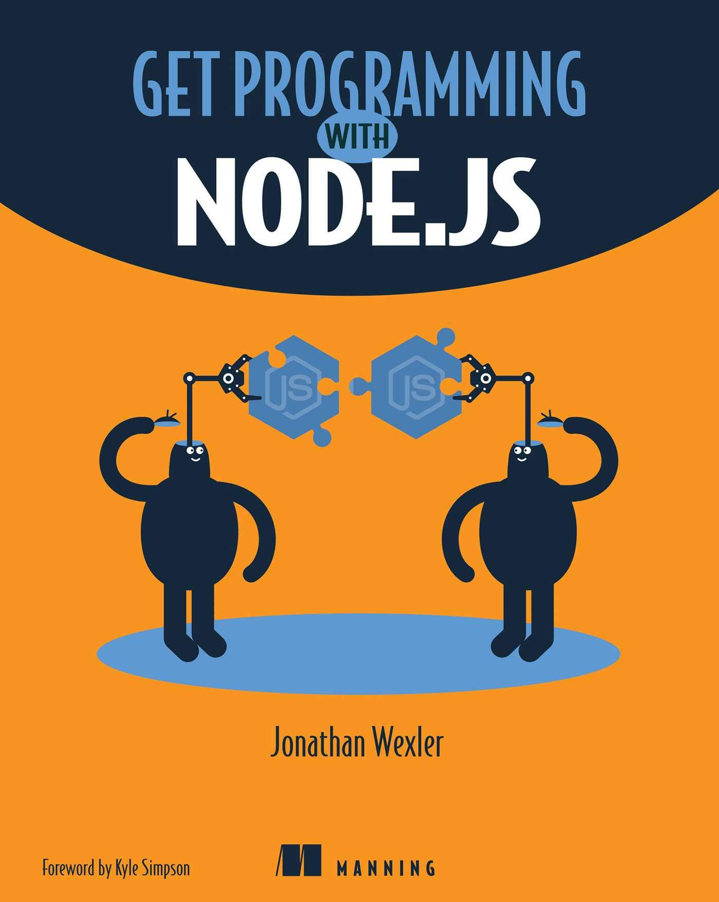

# Getting started with MongoDB

This repo is just to keep track as I work through unit 3 of [Get Programming With Node.js](https://amzn.eu/d/1SdEKQ3) by Jonathan Wexler, which introduces database interaction with Node via MongoDB.

### Lesson 13

- Installed MongoDB, and learned how to connect to a MongoDB database in Node.
- The code in the book doesn't seem to work as written. It's only a few years old but reading documentation [on MongoDB's own website](https://www.mongodb.com/languages/mongodb-with-nodejs) eventually got things sorted and working as intended.

**Note: if the code for this section of the book can't be trusted when following along, then I'm considering switching to PostgreSQL since that's what I'll be working with on the Founders and Coders Software Developer course, and as an apprentice at Opvia.**

### Lesson 14

- Mongoose was introduced as a tool to assist with communication between a Node.js application and its database.
- Again, various alterations had to be made to the code from the book, as Mongoose no longer supports callbacks for a variety of functions, and now favours async await syntax.

### Lesson 15

- Learned to handle database queries and use POST requests to write to the database.
- Dynamically displaying results from databsae queries on a webpage.

### Lesson 16

- Bring everything learned in this module together to enhance the Express server capstone project with database interactivity.